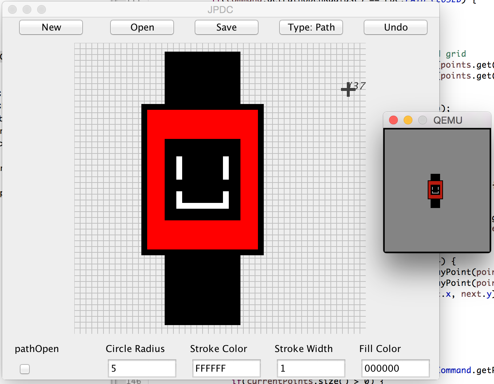

# jpdc

Java
[`PebbleDrawCommand`](http://developer.getpebble.com/guides/pebble-apps/resources/pdc-format/#component-types)
implementation with simple GUI application for drawing icons.




## What it is

* A modular implementation of PebbleDrawCommand and PebbleDrawCommand objects,
  simply use the `src/pdc` package.

* An example implementation to use as a reference for using PDC files in other
  languages. A similar example is the Python
  [`svg2pdc`](https://github.com/pebble-examples/cards-example/blob/master/tools/svg2pdc.py)
  tool.

* A GUI application (run `release/jpdc-0.2.0.jar`) to draw simple icons for use
  in Pebble apps. See the *How to use the GUI* section.

```
$ java -jar release/jpdc-0.2.0.jar
```

* Includes `src/pdc/PebbleColor.java` for conversion between `java.awt.Color`
  and Pebble Color byte values and back.


## What it is not

* A fully complete PDC implementation. The `PrecisePath` type is not
  implemented, neither are PebbleDrawCommandSequences, or objects representing
  the PebbleDrawCommandList or PebbleDrawCommandFrame.

* Bug-free. While most drawings result in usable `.pdc` files, on some occasions
  nothing will appear. The cause is not known.

* In addition, at the moment every path marked as 'open' will be drawn 'closed'.
  A workaround is to draw these paths as separate straight line commands.


## How to use the implementation

* Add the `src/pdc` package to your java project.

* Create a `PDCI` object, supplying the view box of the image:

```java
Dimension viewBox = new Dimension(50, 50);

PDCI drawCommandImage = new PDCI(viewBox);
```

* Create a `PDC` object describing the base properties of the command, according
  to the spec:

```java
Color strokeColor = Color.BLACK;
Color fillColor = Color.WHITE;
int strokeWidth = 2;
int pathOpenRadius = PDC.PATH_CLOSED;

PDC stroke1 = new PDC(PDC.TYPE_PATH, PDC.NOT_HIDDEN, strokeColor, strokeWidth, fillColor, pathOpenRadius);
```

* Add points describing the path of the command, or a single center point in the
  case of a `TYPE_CIRCLE` command:

```java
// Describes a square path
stroke1.addPoint(new Point(0, 0));
stroke1.addPoint(new Point(20, 0));
stroke1.addPoint(new Point(20, 20));
stroke1.addPoint(new Point(0, 20));
```

This can also be done in a builder-type fashion:

```java
// Describes a square path
stroke1.addPoint(new Point(0, 0))
  .addPoint(new Point(20, 0))
  .addPoint(new Point(20, 20))
  .addPoint(new Point(0, 20));
```

* Add the command to the image:

```java
drawCommandImage.addCommand(stroke1);
```

* When you are done adding commands, save the image to disk:

```java
String filePath = "./output.pdc";

drawCommandImage.writeToFile(filePath);
```


## How to use the GUI

* Choose the path type with the appropriate button in the top toolbar.

* Set the parameters of the command using the bottom toolbar.

* The first click on the canvas will begin the command. When the mouse leaves
  the canvas, the command will be added to the image, and be ready for the next
  command. This is the time to set the parameters for the next command.

* Use the 'New' and 'Undo' buttons to wipe the canvas and remove the last
  finished command respectively.

* Use the 'Save' button to choose where to save the file. The directory chosen
  will be remembered for the length of time the application is open. Remember to
  use the `.pdc` extension!

* Add the `.pdc` output
  [as a Pebble project resource and draw in the usual way](http://developer.getpebble.com/tutorials/advanced/vector-animations#drawing-a-pdc-image).

* Use the 'Open' button to load a PDC. Those saved with this tool are more
  likely to work than those that haven't.